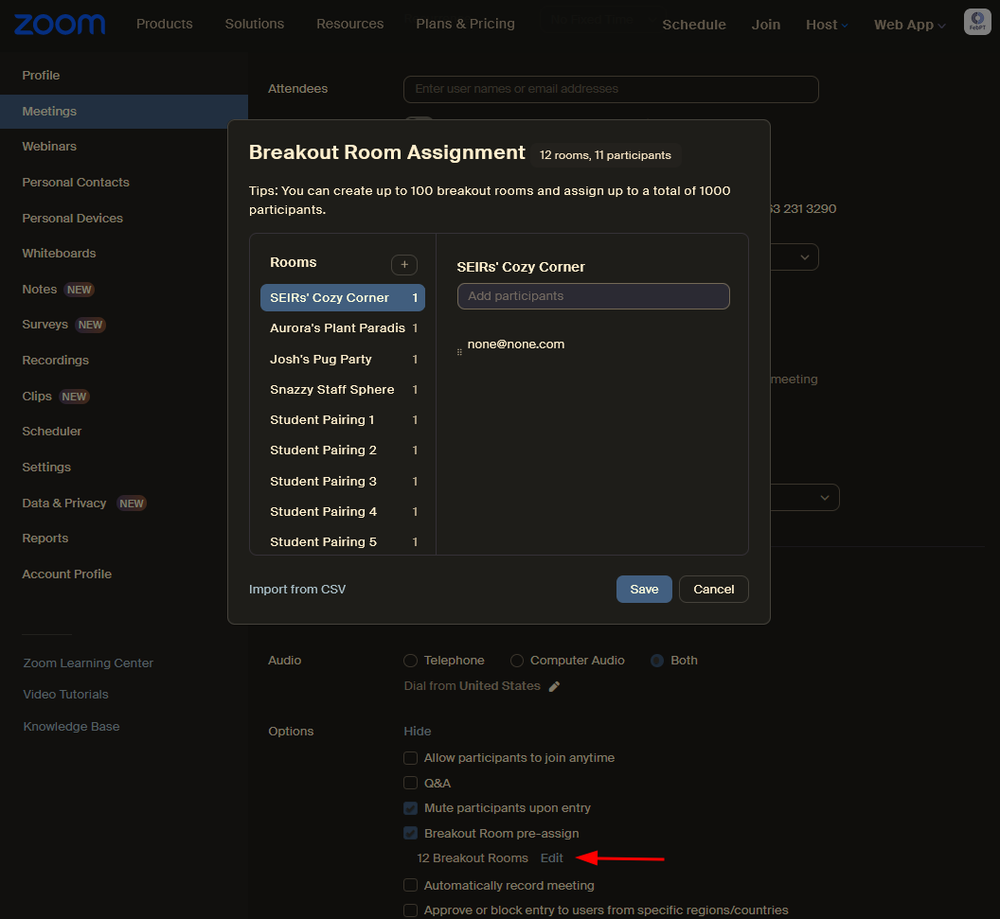
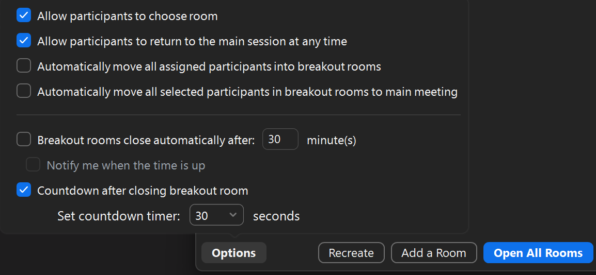

# Breakout Rooms

As a standard practice, the following breakout rooms should be included each time breakout rooms are created:

- Separate offices for each Cohort Lead(CL) where they will hold their office hours and which provides them an easily accessible designated space to have one-off meetings with instructors, SEIRs, or students.

- Rooms for each instructor to meet with one another and to prepare for lectures.

*Note: Each module instructor team will have different needs and requests as it related to breakout rooms.*

Your role as a SEIR is to provide student technical support, and some operational support, and this relies entirely on you being visible and accessible - neither of which is true if you’re hidden away in a breakout room! For this reason, the main room is your room, and if you’re spending more than 15-20 mins there just doing nothing (HMU and PC channels are all quiet), then you should be making a habit of rotating through breakout rooms to observe, drop a knowledge gem, just chat - really start building those relationships with students. This is so key here in the early weeks of M1, if you want to establish yourself as someone they can trust as they progress through the program.

To build on this, Hack Reactor has consistently, across modules, received feedback from students that having too many breakout rooms open here in M1 makes it too easy for them to slink away and not make any connections at all. To this end, *if the number of students is greater than 30*, the number of student breakout rooms should total to no more than half of the student enrollment (ie 80 students = no more than 40 breakout rooms), and a handful of “Quiet study” rooms are created where students can co-work without being specifically invited to do so.

If you are supporting a particularly small cohort, discuss with your CL how many breakout rooms for students they would prefer to have. Cohorts smaller than 20 students tend to be close enough that they don't need as much encouragement to engage with each other.

The following guide can be used to make breakout rooms which will improve your workflow and make lives much easier as a SEIRs. At any rate, when breakout rooms are opened, make sure to select "Allow participants to choose room" in the breakout rooms settings in Zoom, otherwise students will not be able to see that those rooms are opened.

## Creating a Breakout Room Template

When the Zoom classroom is not open, you can edit the meeting settings from the website. One of the available settings is to create a breakout room template that will auto-populate every time you create breakout rooms while the meeting is going. If you know what rooms you'll be using on a day-to-day basis, set them up in this template to save yourself the daily hassle!

Here is a guide that Dre created:
[Creating breakout room templates guide](https://docs.google.com/document/d/1oqkdr-ETPEnaXuAp34hn--0yn-S0PmTimYJDvusxdE8/edit?usp=sharing)

## Opening Breakout Rooms in Zoom

When opening breakout rooms for students, you first need to adjust the rooms' options. By default, meeting participants are not able to select their own rooms, so you will need to change that setting every time you open the rooms.

See the screenshot below for an example of the settings you'll usually want enabled for the rooms:

