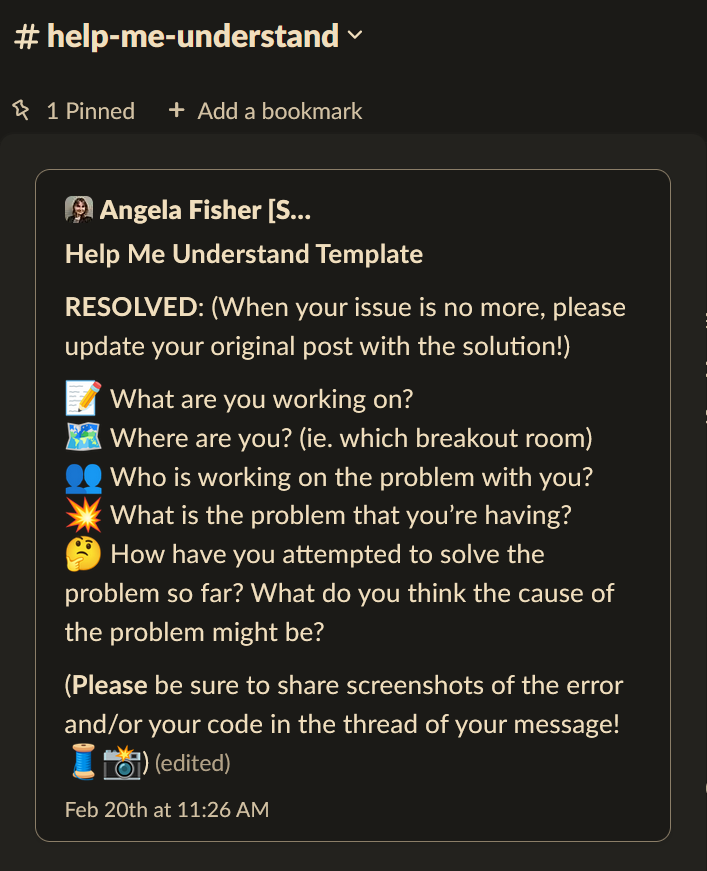

# Help Me Understand

Please refer to the below steps when assisting a student in #help-me-understand:

All requests for coding assistance MUST originate in #help-me-understand. Requests sent via DM to a SEIR or instructor should be redirected to the appropriate channel, as should requests made by coming to find you in Zoom. Students will utilize HMU to post questions during lectures as well, in order to preserve continuity, to be addressed at the conclusion of the lecture.

## Purpose

Utilizing the help-me-understand channel efficiently:
- Creates a space where technical staff can quickly recognize patterns of misunderstanding that need to be addressed and keep a pulse on student progress
- Provides transparency in identifying and addressing student-specific concerns, particularly important for CL record keeping
- Enables staff members to address student needs in the most time efficient manner, directing requests to all technical staff so that the first available person can jump on it
- Organizes and streamlines the sharing of resources by creating topical threads that all students can reference/staff can point students to as they encounter similar problems
- Models problem solving conversations and thought processes in a space where all students can see and are encouraged to participate
- Significantly reduces the amount of time needed doing 1:1 tutoring, increasing student autonomy and peer collaboration opportunities

## Implementation

Each HMU post must contain the following:
- A big screenshot of the error message and all relevant code
- A description of what the student believes the error could be and what they think might be causing it. If they do not know, a guess is acceptable, but we want to see some thought trajectory here!
- A description of what the student has already tried in order to solve it

Posts that do not contain the necessary context will be prompted to provide further information before a staff member prioritizes their problem.

Upon resolution, students are asked to edit their post by adding RESOLVED at the top, indicating that no further assistance is needed, and that resources and conversation that led to the resolution can be found in this thread for their peers to reference.

If your cohort doesn't have a HMU post template pinned yet, you can share the following:
```
Help Me Understand Template

RESOLVED: (When your issue is no more, please update your original post with the solution!)

:memo: What are you working on?
:world_map: Where are you? (ie. which breakout room)
:busts_in_silhouette: Who is working on the problem with you?
:boom: What is the problem that you’re having?
:thinking_face: How have you attempted to solve the problem so far? What do you think the cause of the problem might be?

(Please be sure to share screenshots of the error and/or your code in the thread of your message! :thread::camera_with_flash:)
```

When pasting in Slack, it should look like the following:


## Status Reactions

Staff use a system of status reactions on posts to indicate to one another and to students that they are working on a specific problem:

👀 <- Use this to let people know you’ve seen this and are looking into this. This prevents overlap in problems being addressed. If you see eyes, you know you can move on to the next request!

✅ <- Use this when you believe the ticket is resolved. If the students are also following procedure then they will edit the post with RESOLVED. If they do not after a reasonable amount of time, please remind them as other students with the same problem may be waiting for their solution.

## Prioritization

SEIRs prioritize the help-me-understand channel all day throughout their shift, unless directed otherwise by instructors or CLs. This enables instructors to spend a majority of their time focusing on lecture preparation. SEIRs are always welcome to tag in an instructor for additional assistance as needed on the appropriate HMU thread.

While students are introduced to these procedures early in the course, occasional and gentle reminders may be necessary. It is crucial for all staff members to actively reinforce these procedures consistently. Failing to do so could result in a breakdown of the system, significantly impacting both the team and the student experience. Therefore, it is essential that we proactively address and adhere to these guidelines to maintain a smooth and effective learning environment.
