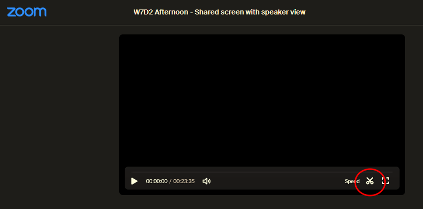
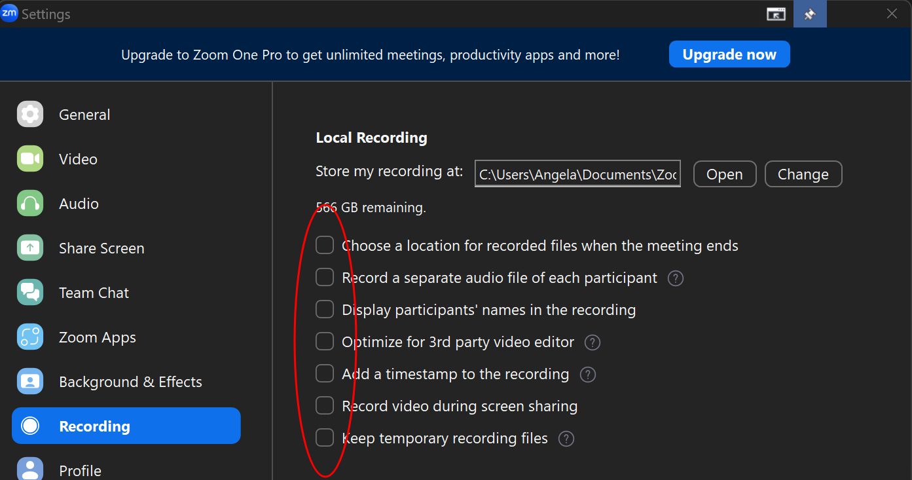

# Recordings

It is the responsibility of SEIRs to ensure that lecture recordings are properly recorded and uploaded by the end of each day. While some instructors will start and stop the recordings on their own, SEIRs should never rely on this and must verify that recordings are done precisely. This applies equally to technical content, practice problem reviews, Career Services lectures, etc.

## Recording Procedure

### Initiating Recordings:
At the start of a recording segment, SEIRs are required to press the "Record" button in Zoom and select **"Record to the Cloud"** to commence the recording.

### Handling Breaks:
- If an instructor calls for a break and the content will resume after the break, SEIRs should press the "Pause" button.
- Upon the break's conclusion, SEIRs should press "Resume" to seamlessly continue recording. This will ensure that the recordings are uploaded without significant deadspace nor the creation of multiple recordings where only one would suffice.
  - If deadspace is accidentally left in, the resulting recording can be trimmed from within the Zoom web player. Once recordings have processed, you can access the trimmer by playing the video and clicking on the scissor icon.
  
- If the content concludes after the break or transitions to distinct content, SEIRs should use the "Stop" button and start a new recording, always saving to the cloud.

## Uploading to Zoom

Recordings will automatically be uploaded to Zoom once the meeting has ended.

If you accidentally recorded the lecture locally instead of to the cloud, there is currently no way to upload those files to the Zoom cloud.

If you know you'll have enough time alone in the main room without students or staff present, there is a workaround to upload the local recording to the cloud:

1. Change your recording settings to have everything unchecked, as per the screenshot below:
   
2. From your file explorer, open up the local recording in your video player of choice.
3. Begin sharing your screen (**with computer audio**) so that Zoom can see the video player.
4. Start recording to the cloud, full-screen your video player, and begin playing the local recording at the player's full volume.
5. Stop the recording when the video ends. It will be uploaded to the cloud as usual when the Zoom classroom is closed!
6. Remember to restore your Zoom recording settings when you're finished. It's important that the speaker's name and video are recorded, so ensure those boxes are now checked.

If you are unable to finagle this workaround, don't panic! Let your CL know that you accidentally recorded locally and cannot retroactively upload the recording to the cloud. You can work together to find a solution, such as uploading the recording to Google drive.

## Uploading to SIS

To upload to SIS, follow these Steps:

1. Log into Zoom's website using the same login credentials used to join meetings.
2. On the main screen's left-hand side, select "Recordings." Organize recordings under Topics by naming them according to the cohort week, day, and time of day (e.g., **W18D2 Morning**).
3. Inside an individual topic, follow these steps:

    3.1. Click "Copy shareable link" in Zoom. Ensure that you know what the recording is about. If you are unsure, cross-reference the daily schedule in SIS and watch a portion of the video.

    3.2. In SIS, on the Recordings page, click "Add a recording" in the top-right corner.

    3.3. Fill out Option 2:

    - Paste the shareable link that you copied from Zoom into the URL field.
    - **Crucially** the passcode for a given recording is located at the end of its Zoom-copied URL from which it must be CUT and pasted into the passcode field in SIS.

#### Example:

Your clipboard after clicking "Copy shareable link." in Zoom:
```
https://galvanize.zoom.us/rec/share/y5U5ylMX2_SAnEGnp-h-k9VK4pU4EUytK-BarDcozz2mRshckpYs5Oe6WYehdm2W.wj3YHQWfmEgW0ezK?startTime=1707844261000
Passcode: K*$W9fu^
```
What should go in the URL field in SIS:
```
https://galvanize.zoom.us/rec/share/y5U5ylMX2_SAnEGnp-h-k9VK4pU4EUytK-BarDcozz2mRshckpYs5Oe6WYehdm2W.wj3YHQWfmEgW0ezK?startTime=1707844261000
```

What should go in the Passcode field in SIS: `K*$W9fu^`

Again, it is imperative that recordings be uploaded to SIS at the end of everyday so that students can reference them as needed.
